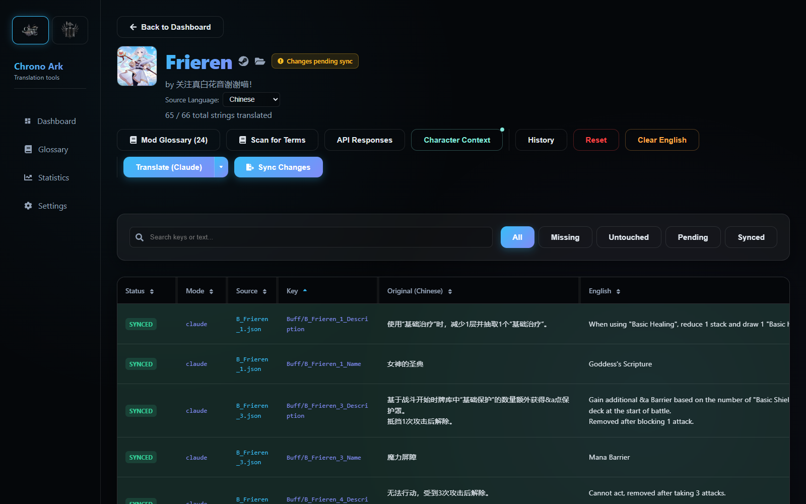
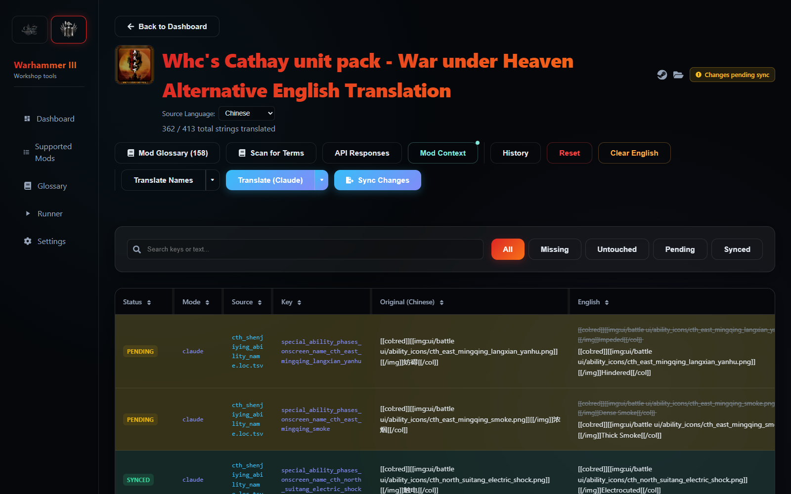
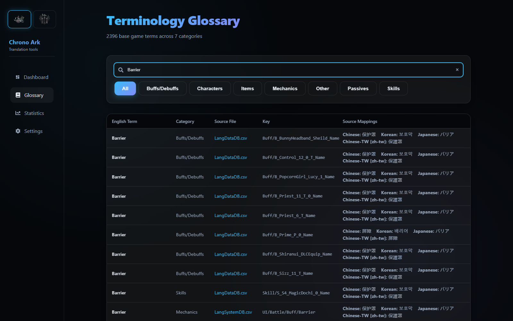
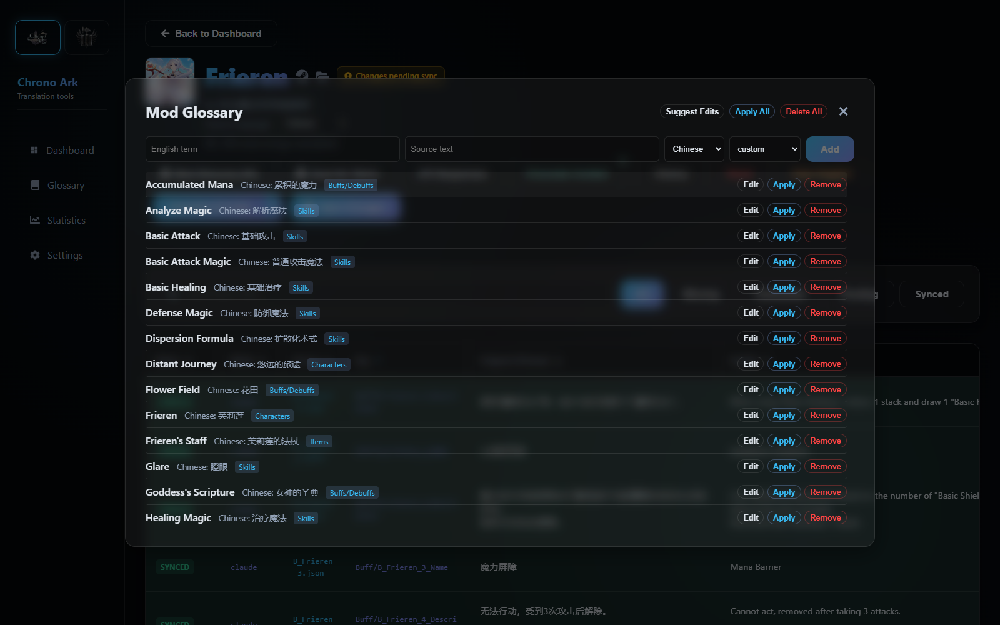
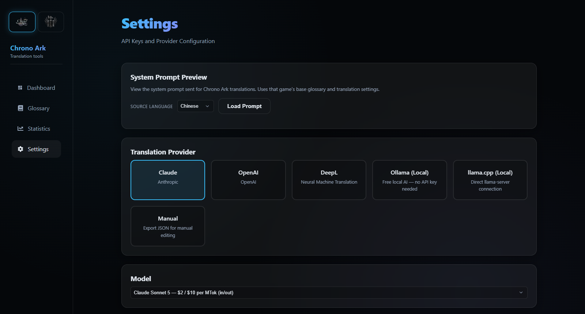
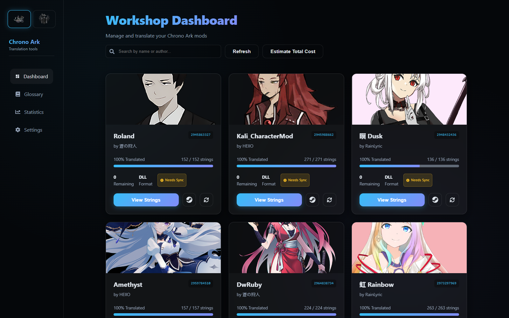
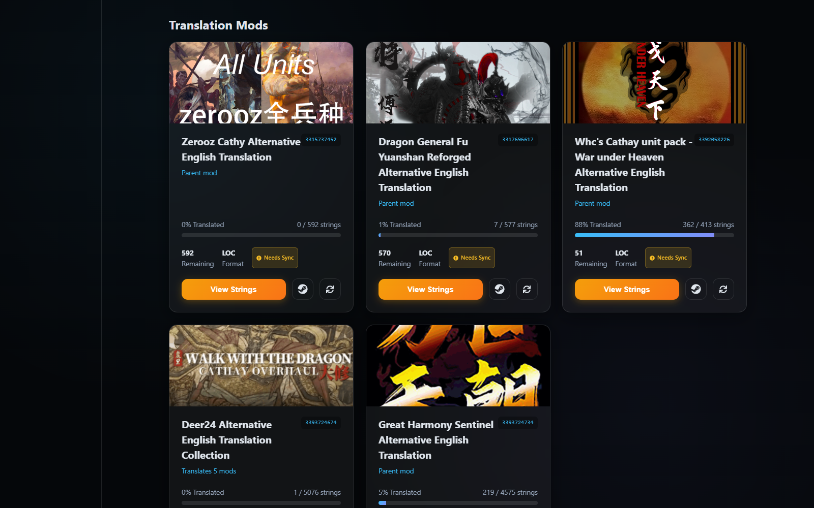
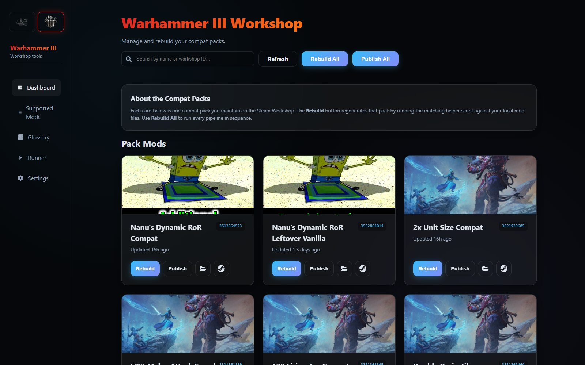
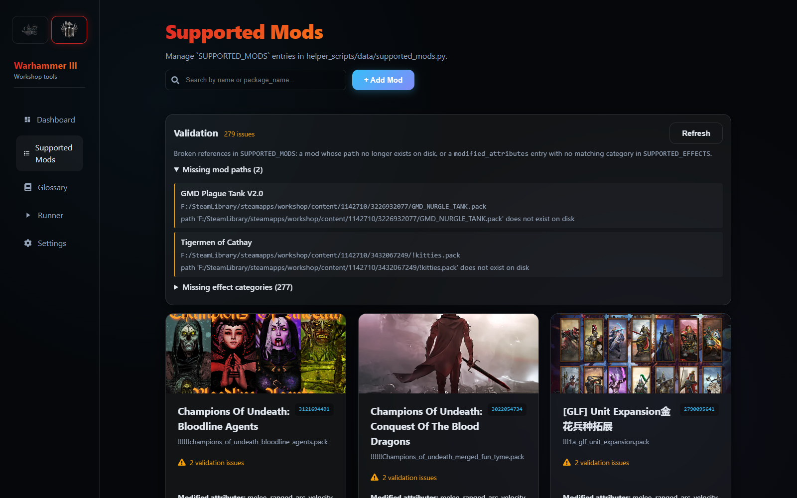
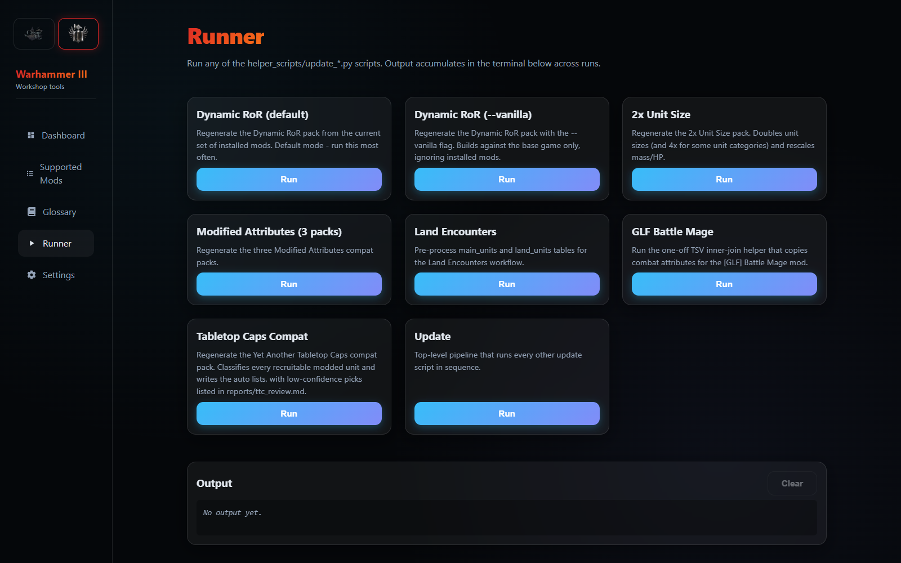

# Steam Workshop Mod Translator

A game-agnostic translation workbench for Steam Workshop mods. A single app hosts several games side by side. Each game plugs in through a backend adapter and a frontend manifest. They all share one translation pipeline, glossary system, provider layer and UI framework. It translates mod localization strings from their source languages into English using AI providers, with glossary enforcement, iterative batch review, manual editing, history snapshots and write-back to mod-ready files.

The project started as a Chrono Ark-only tool (originally named `chrono-ark-translator`) and has since been generalized. It currently supports:

| Game | Slug | Source → Target | What it covers |
| --- | --- | --- | --- |
| [Chrono Ark](https://store.steampowered.com/app/1188930/Chrono_Ark/) | `chrono_ark` | Korean / Chinese / Japanese / Chinese-TW → English | Every installed Workshop mod: CSV, .NET DLL and GData JSON strings, written back into the mod's files |
| [Total War: Warhammer III](https://store.steampowered.com/app/1142710/Total_War_WARHAMMER_III/) | `warhammer_3` | Chinese → English | Translation mods for Cathay-themed Workshop mods: `.loc.tsv` strings, `.pack` rebuilds via RPFM, Workshop publishing, plus tooling for a compatibility-pack registry |

Built with **React 19 + TypeScript + Vite** on the frontend and **Python FastAPI** on the backend. All data is stored as JSON files on disk, so no database is needed.

<table>
  <tr>
    <td></td>
    <td></td>
  </tr>
  <tr>
    <td align="center">Chrono Ark translation page</td>
    <td align="center">Warhammer III translation page, same shared shell</td>
  </tr>
</table>

## Table of Contents

- [Features](#features)
- [Architecture Overview](#architecture-overview)
- [Translation Pipeline](#translation-pipeline)
- [Glossary System](#glossary-system)
- [Supported Translation Providers](#supported-translation-providers)
- [Chrono Ark](#chrono-ark)
- [Total War: Warhammer III](#total-war-warhammer-iii)
- [Adding a New Game](#adding-a-new-game)
- [Configuration](#configuration)
- [Getting Started](#getting-started)
- [Development](#development)

## Features

### Shared framework (every game)

- **Pluggable games**: a backend `GameAdapter` plus a frontend `GameManifest` per game, with a game switcher in the sidebar and game-prefixed URLs (`/chrono_ark/...`, `/warhammer_3/...`)
- **Shared translation page**: one `TranslationPage` shell for every game's strings table. It has search, status filters, sortable and resizable columns, inline editing, and the old value shown struck through above the new one.
- **Five-state row status** shared across games: Synced, Untouched, Pending, Missing, Untranslatable
- **Iterative batch translation** that pauses between batches to review AI-suggested glossary terms
- **Prompt and cost preview** before any run: token counts, estimated cost, and the full system prompt and batch messages in tabs
- **Two-tier glossary**: a base-game glossary built from vanilla text, plus a per-mod glossary layered on top
- **AI glossary suggestions** during translation, "Scan for Terms" on demand, and "Suggest Edits" for existing terms
- **Edit before accept**: rename a suggested term before accepting it, and the new English is also applied to existing translations of that source text
- **Mod / character context** panel for lore-aware prompts
- **History snapshots**: automatic backups before destructive operations, manual labeled snapshots, and point-in-time restore
- **API response log** per mod, recording every provider call with its raw output, tokens and cost
- **Multi-provider AI translation** with Claude, OpenAI, DeepL, Ollama, llama.cpp and a manual mode
- **Local LLM management**: install and run Ollama and llama.cpp from the UI, download models, VRAM tier presets
- **Shared UI kit**: dashboards, cards, modals, banners, split buttons and confirm dialogs used by every game

### Chrono Ark

- Automatic discovery of every installed Workshop mod
- String extraction from localization **CSV** files, **.NET DLLs** and **GData JSON**
- Sync writes translations back into the mod's CSV / GData files, with originals backed up for a clean re-sync
- Duplicate CSV consolidation, translation memory cache, per-mod source/target language overrides
- Dashboard-wide "Estimate Total Cost" and a Statistics page

### Total War: Warhammer III

- Translation mods that track one or more parent Workshop mods, with drift detection when a parent updates
- Base glossary built from vanilla English / Chinese / Korean loc files
- Staged **Translate Names** (units → skills → places → other), with a glossary review after each stage
- Sync writes `.loc.tsv` files and **rebuilds the translation `.pack` with RPFM**
- **Publish to Steam Workshop** through SteamCMD, one pack at a time or all packs in one batch
- Supported-mods registry editor, helper-script runner and registry validation for the external `totalwar-modding` toolkit

## Architecture Overview

```text
Frontend (React + Vite)                         Backend (FastAPI + Uvicorn)
http://localhost:5173                           http://localhost:8008/api
+--------------------------------+              +-------------------------------------------+
| App shell                      |              | Shared routes  /api/...                   |
|   Sidebar + GameSwitcher       |              |   settings, games, models, stats          |
|   /settings (cross-game)       |              |   ollama, llamacpp, steamcmd              |
|   /:gameSlug/*  -> manifest    |<---JSON/SSE->+-------------------------------------------+
+--------------------------------+              | Game adapters (games/registry.py)         |
| Game manifests (src/games/)    |              |   chrono_ark                              |
|   chrono_ark                   |              |   total_war_warhammer_3                   |
|   total_war_warhammer_3        |              |   each mounts /api/games/<game_id>/...    |
+--------------------------------+              +-------------------------------------------+
| Shared UI framework            |              | Shared translation core (translation/)    |
|   translation/ TranslationPage |              |   orchestrator  run_batch()               |
|   ui/ dashboard/ glossary/     |              |   status        5-state RowStatus         |
|   useIterativeTranslation      |              |   game_storage  per-game/per-mod paths    |
|   GlossarySuggestionModal      |              +-------------------------------------------+
+--------------------------------+              | Providers (translator/)                   |
                                                |   Claude, OpenAI, DeepL, Ollama,          |
                                                |   llama.cpp, Manual                       |
                                                +-------------------------------------------+
                                                | Data layer (data/)                        |
                                                |   glossary, suggestions, translations,    |
                                                |   mod settings, context, history, memory  |
                                                +-------------------------------------------+
                                                | File storage  backend/storage/games/<id>/ |
                                                +-------------------------------------------+
```

The frontend talks to the backend only through REST calls and Server-Sent Events (SSE) for streaming work: mod refresh, local-model token streams, script runner logs and Workshop publish logs.

### Backend game plugin model

- **`backend/games/base.py`**: `GameAdapter` is the base every game implements. It has `game_id`, `display_name`, `icon`, `capabilities`, a FastAPI `router`, an optional `settings_schema` and an `on_register()` hook.
- **`backend/games/capabilities/translation.py`**: `TranslationCapability` is a mixin for games that translate strings. It covers mod scanning, string extraction, source-language detection, base-game glossary prompt, format-preservation rules, style examples, game context and export.
- **`backend/games/registry.py`**: maps game ids to adapter classes. `list_games_metadata()` feeds the frontend game switcher through `GET /api/games`.
- **`backend/web_server.py`**: includes the shared routers, then mounts every registered adapter's router under `/api/games/<game_id>`. Per-game routes are selected by URL, not by the "active game" setting. The active game only decides which game the app opens to.
- **`backend/translation/`**: the game-agnostic core. `run_batch()` calls a provider and fills duplicate-source translations. `classify_status()` / `StatusRow` define the shared row status. `GameStorage` resolves per-game and per-mod storage paths.

### Frontend game plugin model

- **`src/games/registry.ts`**: each game registers a `GameManifest` (`id`, `slug`, `displayName`, `icon`, `nav`, `routes`).
- **`src/App.tsx`**: routes `/:gameSlug/*` to the matching manifest's routes, `/settings` to the cross-game Settings page, and everything else to the last active game's dashboard. It also applies per-game branding: accent color, gradient and page title.
- **`src/translation/`**: the shared translation page kit: `TranslationPage`, `StringsTable`, `TranslationToolbar`, `SyncButton`, `BatchReviewBanner`, `TranslatingBanner`, `ContextPanel`, `HistoryModal`, `ApiResponsesModal`, `GlossaryEditor`, `LanguageControls` and status badges. Game pages own their data and state and pass it into these components.
- **`src/ui/`, `src/dashboard/`, `src/glossary/`**: generic primitives, dashboard layout, and the shared base-glossary browser.

### Storage layout

```text
backend/storage/
  games/
    chrono_ark/
      glossary.json                  base-game glossary
      translation_memory.json
      mods/<workshop_id>/            translations, glossary, suggestions, progress,
                                     context, settings, history/, original_csvs/, ...
    total_war_warhammer_3/
      glossary.json                  base glossary built from vanilla text
      parent_pack_cache/<parent_id>/ cached RPFM extracts of parent packs
      mods/<translation_workshop_id>/
                                     translations, parent_snapshot, glossary, suggestions,
                                     api_responses, prompt_options, snapshots/, ...
  bin/  models/  logs/  steamcmd/    managed llama.cpp, GGUF models, process logs, SteamCMD
  _migrations/                       markers for one-time storage migrations
```

Storage migrations in `backend/scripts/` run automatically at startup. They move the original flat, Chrono Ark-only layout into `games/chrono_ark/`.

## Translation Pipeline

Both games use the same pipeline. Only the extraction, prompt content and write-back differ.

### 1. Preview and cost estimation

Clicking Translate calls the game's `POST /translate/preview`. The backend gathers the strings that need translating, splits them into batches of `SWMT_BATCH_SIZE`, and estimates the cost with the provider's pricing. It also builds the full system prompt and per-batch user messages. The confirmation modal shows these in tabs before anything is sent.

### 2. Iterative batch processing

The `useIterativeTranslation` hook runs a state machine that sends one batch at a time:

```text
idle -> translating -> [reviewing] -> translating -> ... -> complete
                           ^                                  |
                           +---- (if suggestions exist) ------+
```

For each batch the backend builds a prompt from the following:

- the translator role
- game context
- format-preservation rules
- style examples
- glossary terms
- mod/character context

The provider returns JSON with `translations` and `suggested_terms`. Keys that share the same source text get the same translation. Results are saved to the mod's `translations.json`.

### 3. Glossary review between batches

When a batch produces new term suggestions, the run pauses and opens the review modal. Each term can be accepted, dismissed, or edited first. You can also accept or dismiss all at once. Accepted terms apply to every remaining batch. If you edit a suggestion's English before accepting, existing translations that use the old wording are updated to the new English, and those rows become Pending.

### 4. Streaming for local models

With Ollama or llama.cpp, batches stream over SSE. The UI shows tokens per second and elapsed time, and you can cancel mid-stream. Cloud providers return complete responses.

### 5. Row status and sync

Every row is shown with one of the shared statuses:

| Status | Meaning |
| --- | --- |
| **Synced** | The translation matches what is written to the mod's files |
| **Untouched** | English already existed in the mod and was not changed |
| **Pending** | Translated or edited here, not yet synced to disk, or the source text changed since the last sync |
| **Missing** | No translation yet |
| **Untranslatable** | Skipped, for example keys with no translatable text |

**Sync Changes** writes the translations into the game's file format. **Re-sync Changes** re-applies them after the source files change.

## Glossary System

### Base-game glossary

Each game builds a read-only glossary from vanilla game text. It maps English terms to their source-language forms, grouped by category. The Glossary page shows it with search and category filters. The prompt includes only the categories that are relevant to that game.



### Per-mod glossary

Each mod has its own glossary layered over the base one. The Mod Glossary modal lets you:

- add, edit, rename and delete terms, or delete all of them
- **Apply** a rename across existing translations with a before/after preview
- **Suggest Edits**: ask the AI to refine existing terms

Per-mod terms are sent in the prompt together with the base glossary, and they take precedence over it.



### AI suggestions

- **During translation**: providers propose recurring or significant terms. These are stored in `pending_suggestions.json` until you review them.
- **Scan for Terms**: finds terms in the mod's source text without translating it.
- Suggestions that match a term that already exists or is already pending are dropped, unless they are edits of an existing term.

## Supported Translation Providers

| Provider | Type | Streaming | Glossary suggestions | Cost |
| --- | --- | --- | --- | --- |
| **Claude** (Anthropic) | Cloud API | No | Yes | Per-token |
| **OpenAI** | Cloud API | No | Yes | Per-token |
| **DeepL** | Cloud API | No | No | Per-character |
| **Ollama** | Local LLM | Yes (SSE) | Yes | Free |
| **llama.cpp** | Local LLM | Yes (SSE) | Yes | Free |
| **Manual** | JSON export | N/A | N/A | Free |

Chrono Ark can use any provider. Warhammer III translation currently always uses Claude.

- **Cloud providers**: API keys are set on the Settings page and saved to `backend/.env`. Only the last 4 characters are shown in the UI. Claude and OpenAI models are chosen from a catalog that includes per-model pricing.
- **Local providers**: Settings can install Ollama or llama-server and start or stop them. It can pull or download models (GGUF from Hugging Face) with a progress display, and offers VRAM tier presets (4-6GB to 24GB+). For llama.cpp you can also set GPU layers and context size. After a run, llama.cpp is stopped to free VRAM.
- **Manual**: exports untranslated strings as JSON for offline translation.



## Chrono Ark

Pages: `/chrono_ark/dashboard`, `/chrono_ark/translation/:modId`, `/chrono_ark/glossary`, `/chrono_ark/statistics`.

### Mod discovery and extraction

The adapter scans the Workshop folder (app id `1188930`). For each mod it reads `ChronoArkMod.json` and finds these localization resources:

- **CSV** (`csv_extractor.py`): `Localization/*.csv`. Handles UTF-8 BOM, rows split across lines, and columns shifted into the wrong language (checked by the script of the text).
- **DLL** (`dll_extractor.py`): reads `Assemblies/*.dll` with `dotnetfile` without running .NET. It pulls strings from the user-strings heap and uses IL analysis to find key/value `ldstr` pairs. Framework DLLs such as Harmony are skipped.
- **GData** (`gdata_extractor.py`): `gdata/Add/*.json` Game Data Editor objects (skills, buffs, equipment, characters, dialogue arrays), mapped to CSV-style keys.

Duplicates across CSV and GData are removed. The source language is detected per string (Chinese > Korean > Japanese > Chinese-TW), and each mod can override its source and target language.

### Dashboard

A card grid of every installed mod. Each card shows:

- a progress bar
- remaining string count
- the mod's format (CSV or DLL)
- a "Needs sync" badge when there is unsynced work

**Refresh** rescans the Workshop folder and streams progress. **Estimate Total Cost** prices a full translation of every mod with the current provider. Mods listed in `SWMT_IGNORED_MODS` are hidden.



### Sync and export

**Sync Changes** writes translations directly into the mod's CSV and GData files. It backs up the originals first, so **Re-sync** can restore them and write again from a clean base. If a mod has more than one CSV for the same language, sync merges them into one canonical file. **Reset** restores the original files and deletes the mod's stored data.

### History, translation memory and statistics

- **Automatic backups** are taken before manual edits, sync, clearing translations, glossary changes, replace operations and accepting suggestions. You can also save labeled snapshots. The last 20 are kept per mod, and any of them can be restored.
- **Translation memory**: a cache keyed by a hash of the source text, so the same source string in different mods reuses its translation.
- **Statistics**: global progress, translation memory size and cache hits.

## Total War: Warhammer III

Pages: `/warhammer_3/dashboard`, `/warhammer_3/translation/:workshopId`, `/warhammer_3/glossary`, `/warhammer_3/supported-mods` (plus `/new` and `/edit/:packageName`), `/warhammer_3/runner`.

WH3 support is tied to the external **`totalwar-modding`** repository. Its `helper_scripts/` folder holds `rpfm_cli.exe`, the WH3 schemas, generator scripts and the `SUPPORTED_MODS` registry. Its `warhammer3_mods/` folder holds the translation mods' loose `.loc.tsv` sources.

### Translation mods

A translation mod is your own Workshop item that translates one or more **parent** mods. The mods are registered in `backend/games/total_war_warhammer_3/translation_mods.py`. Each entry has these fields:

- `workshop_id`
- `display_name`
- `parent_workshop_ids`: a list, so one translation can cover a whole collection
- `local_source_dir`: where your `.loc.tsv` files live
- a file-name `prefix` that controls load order

The Dashboard lists these as cards with progress, a stale-row segment and a "Needs Sync" badge.



### Source strings and drift

- Each parent's `.pack` is extracted with `rpfm_cli` from the Workshop folder (app id `1142710`). The extract is cached until the pack's modification time changes.
- Your existing translations come from the local `.loc.tsv` files. File names are matched to the parent's file names with the load-order prefix (`@@`, `!!!`) removed.
- A **parent snapshot** stores a SHA-256 hash of each parent string. When a parent mod updates, the rows whose source changed become **Pending** (stale). New keys show as **Missing**. Orphans, meaning keys that the parent no longer has, are hidden from the table and pruned from disk on Sync.

### Base glossary from vanilla text

```bash
python -m backend.games.total_war_warhammer_3.build_base_glossary --vanilla-root <dir> [--out <path>]
```

The command reads `vanilla_text_en/db/*.loc.tsv`, `vanilla_text_cn/text/localisation__.loc.tsv` and `vanilla_text_kr/text/localisation__.loc.tsv`. These are extracted vanilla files kept local and gitignored. It builds an English / Chinese / Korean glossary of unit stats, unit attributes, common UI terms and region names. Region names appear on the Glossary page, but they are not sent in prompts.

### Translate Names

Translating names first keeps the rest of the text consistent. The **Translate Names** split button runs name keys in four stages. A batch never mixes stages:

1. **Units & Lords**
2. **Skills & Abilities**
3. **Buildings & Locations**
4. **Items, Traits, Techs & Rituals**

After each stage, the translated names are turned into glossary suggestions. A review modal then offers "Continue to <next stage>" or "Finish". Closing the modal pauses the run and shows a Continue / Stop banner.

The same menu has **Suggest from Translated Names**, which proposes glossary terms from names that are already translated but not in the glossary. A per-mod option, **"Also send translated names that aren't in the glossary"**, adds those names to every prompt.

### Sync and pack rebuild

**Sync Changes** runs these steps in order:

1. Takes a snapshot.
2. Prunes orphan keys.
3. Writes every translation into your `.loc.tsv` files.
   - Only the matching rows are edited, and new keys are appended.
   - Real newlines and tabs are escaped as `\\n` / `\\t`, the escaping RPFM expects.
   - A missing file is created with the mod's prefix.
4. Re-baselines the parent snapshot, so stale rows become Synced.
5. **Rebuilds the translation `.pack`**.
   - The TSVs are checked first, so a malformed row cannot corrupt the pack.
   - Then `rpfm_cli` replaces the pack's `text/` folder inside the mod's Workshop content folder.

A failed rebuild is shown as a warning, and the sync itself still succeeds.

### Snapshots

Snapshots capture the following:

- translations
- the parent snapshot
- API responses
- the mod glossary
- the full text of every `.loc.tsv` file

They are taken automatically before these operations:

- sync
- clearing translations
- restore
- glossary apply-all
- accepting suggestions
- deleting the glossary

You can also save labeled snapshots. The last 20 are kept per mod, and restoring one takes a safety snapshot first.

### Compatibility packs, Runner and Workshop publishing

- **Pack Mods** on the Dashboard: preview, last-updated time, Steam link, open folder, **Rebuild** (runs the matching helper script) and **Publish**. The header has **Rebuild All** and **Publish All**.
- **Supported Mods**: a form editor for `helper_scripts/data/supported_mods.py`.
  - It covers basics, modified attributes (autocompleted from `SUPPORTED_EFFECTS`), pattern overrides, character overrides and ignore-generation.
  - Writes use `libcst`, so comments and formatting are kept.
  - Every write backs up the file first and restores it if the result fails to load.
  - A validation panel flags modified attributes that are not a known effect category, and mod paths that are missing on disk.
- **Runner**: runs the helper scripts one at a time and streams their output into a shared terminal, with cancel. Scripts include `update_dynamic_rors`, `update_double_unit_size`, `update_modified_attribute_mods`, `process_main_units_tables`, `glf_inner_join`, `update_ttc_compat` and `update`.
- **Publish to Workshop**: runs `steamcmd +workshop_build_item` with a minimal VDF. Only the content and an optional change note are uploaded, so the existing title, description and tags stay as they are.
  - **Publish All** publishes several packs in sequence with one shared change note, and shows each pack's progress.
  - No password is stored. Log in once with `steamcmd +login <username>` to cache Steam Guard, and SteamCMD reuses that session.

<table>
  <tr>
    <td></td>
    <td></td>
    <td></td>
  </tr>
  <tr>
    <td align="center">Pack mods: Rebuild / Publish</td>
    <td align="center">Supported Mods + validation</td>
    <td align="center">Script Runner</td>
  </tr>
</table>

### Current limitations

- WH3 translation always uses Claude, and runs cannot be cancelled mid-batch.
- The Mod Context panel and the per-mod language overrides are saved, but they are not yet used in WH3 prompts.
- The list of translation mods, the Dashboard pack list and the Runner script list are hard-coded. To add an entry, edit the code.

## Adding a New Game

1. **Backend adapter**
   - Create `backend/games/<game_id>/adapter.py` with a class that subclasses `GameAdapter` and `TranslationCapability`.
   - Build its `router` with the prefix `/api/games/<game_id>`. Implement the endpoints the shared UI expects (`/translate/preview`, `/translate/batch`, glossary suggestions, strings and sync), reusing `run_batch()`, `classify_status()` and `GameStorage`.
   - Register the class in `_ADAPTERS` in `backend/games/registry.py`.
2. **Frontend manifest**
   - Create `src/games/<game_id>/index.tsx`, which calls `registerGame({ id, slug, displayName, icon, nav, routes })`, and import it in `src/App.tsx`.
   - Build the pages from the shared `TranslationPage`, dashboard and glossary components.
3. **Branding**
   - Add a logo to `src/assets/games/`.
   - Add an entry to `GAME_BRANDING` in `src/components/GameSwitcher/branding.ts`.

## Configuration

Settings are environment variables with a `SWMT_` prefix, stored in `backend/.env`. Most of them can be changed at runtime on the Settings page, which writes them back to `.env`.

### General and providers

| Variable | Default | Description |
| --- | --- | --- |
| `SWMT_API_PORT` | `8008` | Backend port (Vite reads it too) |
| `SWMT_STORAGE_PATH` | `backend/storage` | Root data directory |
| `SWMT_ACTIVE_GAME` | `chrono_ark` | Game the app opens to |
| `SWMT_TRANSLATION_PROVIDER` | `claude` | `claude`, `openai`, `deepl`, `ollama`, `llamacpp` or `manual` |
| `SWMT_BATCH_SIZE` | `100` | Strings per translation batch |
| `SWMT_ANTHROPIC_API_KEY` | | Claude API key |
| `SWMT_OPENAI_API_KEY` | | OpenAI API key |
| `SWMT_DEEPL_API_KEY` | | DeepL API key |
| `SWMT_CLAUDE_MODEL` | `claude-sonnet-5` | Claude model |
| `SWMT_OPENAI_MODEL` | `gpt-4.1` | OpenAI model |
| `SWMT_OLLAMA_BASE_URL` | `http://localhost:11434` | Ollama server URL |
| `SWMT_OLLAMA_MODEL` | `qwen2.5:7b` | Ollama model |
| `SWMT_LLAMACPP_BASE_URL` | `http://localhost:8080` | llama-server URL |
| `SWMT_LLAMACPP_BINARY_PATH` | `llama-server` | llama-server binary (falls back to the managed install, then `PATH`) |
| `SWMT_LLAMACPP_MODEL_PATH` | | GGUF file to load |
| `SWMT_LLAMACPP_MODELS_DIR` | `backend/storage/models` | GGUF download directory |
| `SWMT_LLAMACPP_GPU_LAYERS` | `-1` | GPU layers to offload (`-1` = all) |
| `SWMT_LLAMACPP_CTX_SIZE` | `8192` | Context window size |
| `SWMT_GLOSSARY_CATEGORIES` | `characters,mechanics` | Chrono Ark base-glossary categories sent in prompts |
| `SWMT_IGNORED_MODS` | | Comma-separated mod IDs to hide from the dashboard |

### Chrono Ark

These are read from `.env` only. They are not on the Settings page.

| Variable | Default | Description |
| --- | --- | --- |
| `SWMT_BASE_GAME_PATH` | `F:\SteamLibrary\steamapps\common\Chrono Ark\ChronoArk_Data\StreamingAssets` | Base game data |
| `SWMT_WORKSHOP_PATH` | `F:\SteamLibrary\steamapps\workshop\content\1188930` | Chrono Ark Workshop content |

### Total War: Warhammer III and Steam

| Variable | Default | Description |
| --- | --- | --- |
| `SWMT_TW3_HELPER_PATH` | | Path to `totalwar-modding/helper_scripts` |
| `SWMT_TW3_RPFM_CLI_PATH` | | `rpfm_cli.exe`. Defaults to `<helper_scripts>/rpfm_cli.exe`, and the `schemas/` folder must sit next to it. |
| `SWMT_TW3_STEAM_LIBRARY_DRIVE` | | Drive that holds `SteamLibrary`, e.g. `F:` |
| `SWMT_STEAMCMD_PATH` | | `steamcmd.exe`. Leave it empty to disable publishing, or use "Install SteamCMD" in Settings. |
| `SWMT_STEAM_USERNAME` | | Steam account for publishing (no password stored) |

## Getting Started

### Prerequisites

- **Node.js** (v18+) and **Yarn**
- **Python 3.12+**
- For Chrono Ark: the game installed through Steam, with Workshop mods subscribed
- For Warhammer III: the game with the parent mods subscribed, plus a local checkout of `totalwar-modding`, which provides the helper scripts, `rpfm_cli.exe` and schemas. SteamCMD is also needed if you want to publish.

### Installation

1. Clone the repository:
   ```bash
   git clone https://github.com/steve1316/steam-workshop-mod-translator.git
   cd steam-workshop-mod-translator
   ```

2. Install frontend dependencies:
   ```bash
   yarn install
   ```

3. Install backend dependencies:
   ```bash
   pip install -r backend/requirements.txt
   ```

4. Create `backend/.env` with the paths and keys for the games you use:
   ```env
   SWMT_ANTHROPIC_API_KEY=your-key-here

   # Chrono Ark
   SWMT_BASE_GAME_PATH=C:\path\to\SteamLibrary\steamapps\common\Chrono Ark\ChronoArk_Data\StreamingAssets
   SWMT_WORKSHOP_PATH=C:\path\to\SteamLibrary\steamapps\workshop\content\1188930

   # Total War: Warhammer III (can also be set on the Settings page)
   SWMT_TW3_HELPER_PATH=C:\path\to\totalwar-modding\helper_scripts
   SWMT_TW3_STEAM_LIBRARY_DRIVE=F:
   ```

5. Start the frontend and backend together:
   ```bash
   yarn start
   ```

6. Open `http://localhost:5173`. Switch games with the switcher at the top of the sidebar.

### CLI

The backend also has a CLI for headless Chrono Ark work. Pass `--game <id>` to target a game other than the active one.

```bash
python -m backend.main extract --base-game       # Extract base game strings (or --mod <id> / --all-mods)
python -m backend.main translate --mod <id>      # Translate a mod (--provider claude|openai|deepl, --dry-run)
python -m backend.main status [--mod <id>]       # Show translation status
python -m backend.main glossary --show           # Display the glossary (or --build / --add SOURCE ENGLISH)
python -m backend.main export --mod <id>         # Export translations to CSV
```

## Development

```bash
yarn test                    # Frontend tests (Vitest + Testing Library, jsdom)
python -m pytest backend     # Backend tests (pytest)
yarn lint                    # ESLint
yarn format                  # Prettier for the frontend, Black for the backend
yarn build                   # Type-check and production build
```
